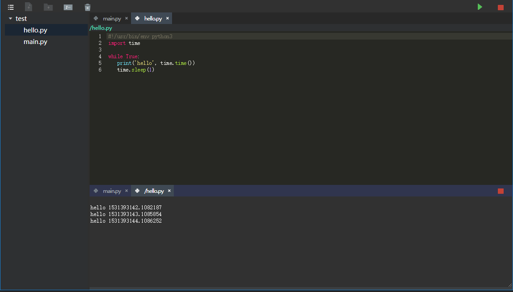

# Python-Web-IDE
-----------
>  一个简易的在线Python的IDE
>  前后端分离

## 概述
在线Python IDE在实现上前后端分离，后端使用Python的Tornado框架实现，前端使用Vue来实现，前后端使用websocket来通信。

### 技术栈
- Python/Tornado
- JS/Vue

## 功能描述
- 支持工程、文件、文件夹的增删查改
- 支持Python代码基本补全
- 支持Python代码运行管理和输出

编码:

补全:

运行:


## 编译与运行
### 前端
``` bash
# 安装依赖
npm install 或者 yarn install

# 开发运行(默认端口是8080)
npm run dev 或者 yarn run dev

# 打包编译(默认打包的路径已经指定在后端程序可以加载的地方)
npm run build 或者 yarn build
```
### 后端
```
# 进入backend目录
cd backend

# 安装依赖
pip install -r requirements.txt

# 运行（运行端口为10086）指定端口可以使用参数 --port=10010
# 如果前端页面是独立运行的，不可指定后端端口（除非修改前端代码）
python server.py

#访问 (工程保存在backend/projects/ide里面)
开发运行前端的情况: localhost:8080
打包好前端的情况: localhost:10086
```
### 后续支持
- 用户区分
- 配置文件